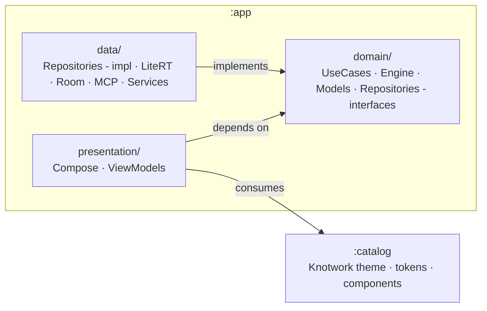
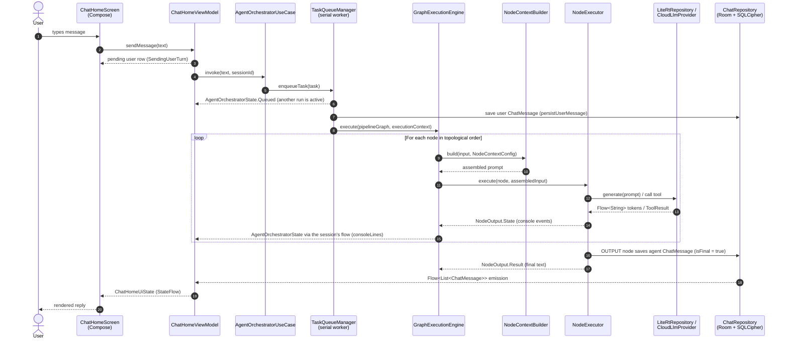
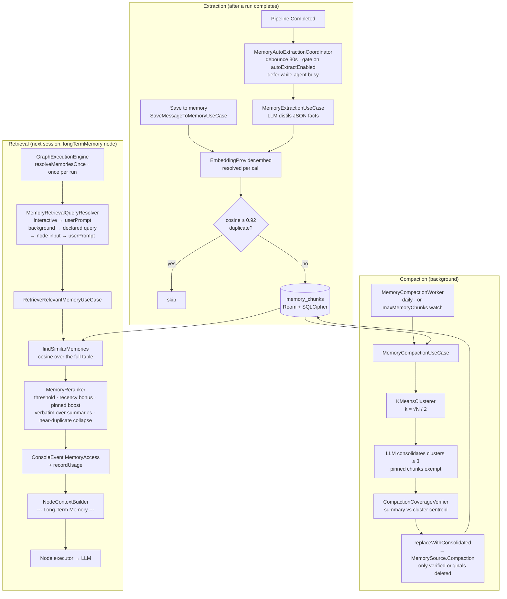
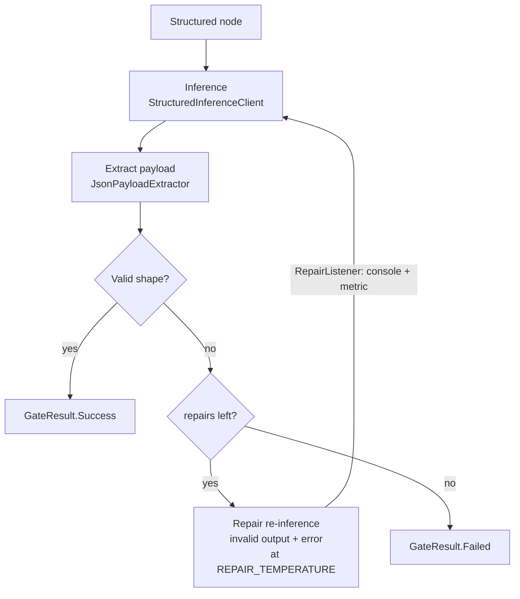
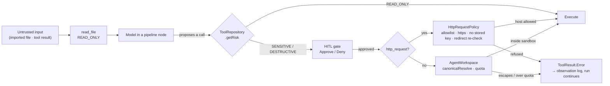
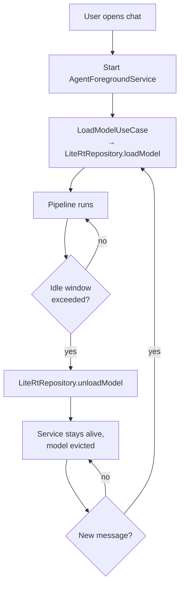
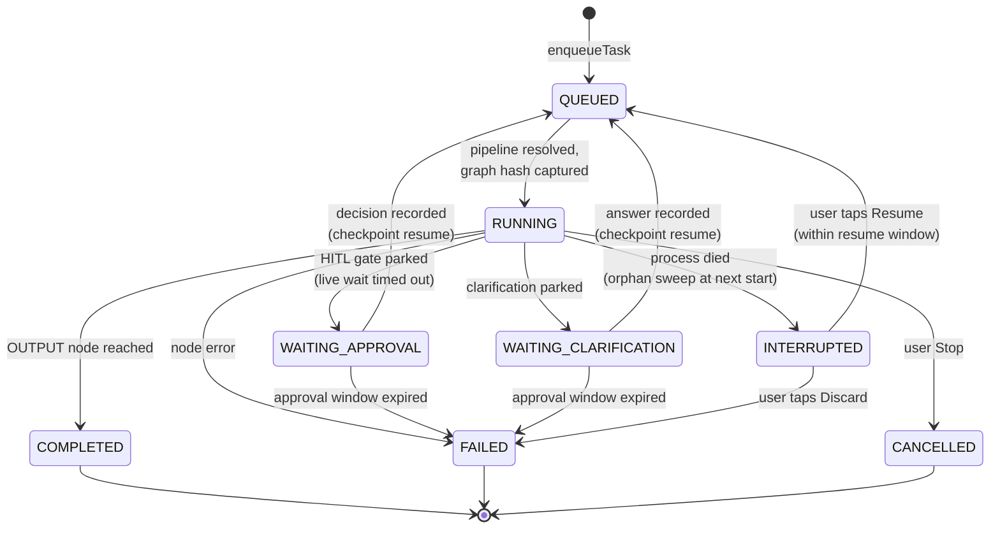
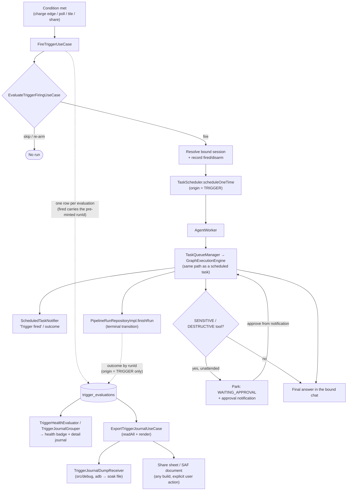

# Architecture

This document is a developer-facing overview of Knotwork, an on-device AI
agent for Android. It is intended for contributors and external readers who want to
understand the shape of the codebase without reading every file. For
end-user guidance, see [`docs/user-guide.md`](user-guide.md); for recipes
on adding new functionality, see [`docs/extending.md`](extending.md).

All diagrams below are written in [Mermaid](https://mermaid.js.org/) and
render natively in GitHub markdown — no external tooling required.

---

## 1. Clean Architecture overview

The codebase is split into three Gradle modules:

```
:app        — Android application; hosts presentation / domain / data layers
:catalog    — Knotwork design-system Android library (theme, tokens, components)
:tools-probe — Debug-only companion app for the AppFunctions end-to-end test
```

Inside `:app`, the source tree is split into the three Clean Architecture
layers under `app/src/main/java/app/knotwork/android/`:

```
app/
├── presentation/   # Jetpack Compose UI, ViewModels (MVVM)
├── domain/         # Use cases, agent logic, tool abstractions, models
└── data/           # Repository implementations, engines, I/O, services
```

Dependencies flow strictly inward — `data` and `presentation` both depend
on `domain`, but `domain` depends on nothing else in the project. The
`domain` layer contains zero Android-framework imports (`android.*`,
`androidx.*`) and is pure Kotlin plus Coroutines.

`:catalog` is a leaf module: it exports `KnotworkTheme` and design-system
primitives, and depends on Compose only. `:app` consumes it as an
`implementation` dependency from the presentation layer; no domain or
data code is allowed to reference `:catalog`.



Each layer maps onto concrete packages:

| Layer          | Packages                                                                                          |
|----------------|---------------------------------------------------------------------------------------------------|
| `presentation` | `presentation/ui/{about,automation,chat,common,components,discover,files,help,memory,models,monitoring,more,navigation,onboarding,orchestrator,pipeline,prompts,settings,skills,splash,taskmonitor,tools,triggers}`, `presentation/{common,notifications,receivers,run,share,shortcuts,state,theme,tile}` |
| `domain`       | `domain/{constants,engine,memoryio,models,pipelineio,prompt,promptio,promptpack,report,repositories,services,settings,skillio,text,triggerio,usecases}` |
| `data`         | `data/{audio,engine,local,logging,mappers,mcp,network,prompt,repositories,services,testing,tools}` |

Cross-layer wiring is handled by **Hilt**. Modules in `di/` provide
external dependencies (Room, Retrofit, LiteRT, prompt-variable providers,
local-tool executors) and bind data-layer implementations to domain-layer
interfaces.

### 1.1. App shell and navigation

The presentation layer is hosted by a single `NavHost` declared in
`presentation/ui/navigation/AppNavGraph.kt`. The graph wires:

- **Splash** → **Onboarding** (only when `SettingsRepository.isFirstLaunch`
  is `true`) → **Chat tab**. After onboarding, the flag is persisted as
  `false` so subsequent launches go straight to Chat.
- Four top-level **tabs** rendered by `AppShellScaffold`'s Material3
  `NavigationBar` — **Chat / Pipelines / Tools / More** — chosen over a
  drawer so the primary destinations stay one tap away.
  Tab state — back-stack, scroll position, ViewModel state — is preserved
  across switches and rotations using the canonical
  `popUpTo(startDestination) { saveState = true } + restoreState = true`
  pattern.
- **Secondary destinations** live as additional `composable(...)` entries
  reachable from inside a tab. The pipelines tab is a nested `navigation { }`
  graph so the library and editor share a single `OrchestratorViewModel`
  scoped to the graph entry. The More tab is the umbrella for the thirteen
  secondary surfaces, grouped into four named sections (Automation, Your
  content, Building blocks, App); the sections are labels rendered by
  `MoreContent`, not destinations.
- **Which tab is highlighted, and whether Back exits, are derived from the
  back stack** (`presentation/ui/navigation/TabOwnership.kt`), not from a
  `route → tab` table. A screen belongs to the tab it was opened from, so a
  destination added to the graph cannot silently highlight nothing. A tab root
  is entered only through `navigateToTab`, never pushed on top of another
  subtree's stack; a surface that must be reachable from two subtrees is
  registered at two routes instead (`NavRoutes.SETTINGS_TOOLS_MANAGE`).
- **Modal sheets** (`NodeConfigSheet`, `ConsolePane`, `AddMcpServerScreen`)
  share a single `KnotworkModalRoute` wrapper that combines Material3
  `ModalBottomSheet` with `PredictiveBackHandler` so Android 14+
  predictive-back animates the sheet in lockstep with the user's drag.
- Deep-links: `knotwork://chat/{threadId}` resolves to the parameterised
  `chat/{threadId}` route, forwarding the thread id to `ChatHomeViewModel.switchSession`.

Bottom-nav visibility per route is decided by the pure
`shouldShowBottomNav(route)` function (`BottomNavVisibility.kt`) — the
bar is hidden on Splash, Onboarding, Pipeline editor (full-screen
canvas), and any `sheet/...` route. While the user is on a tab's
start-destination, `BackHandler` short-circuits the system Back gesture
to `activity.finish()` so Back exits the app rather than switching tabs.

### 1.2. Presentation: ViewModel coordinator and domain delegates

A screen ViewModel consolidates everything its screen renders into a single
immutable state class exposed through one `StateFlow` (e.g.
`ChatHomeViewModel` → `ChatHomeScreenState`), and every mutation funnels
through `_state.update { it.copy(...) }`. To stop such a ViewModel growing into
a God-object, each cohesive responsibility is extracted into a **delegate**
class and the ViewModel becomes a thin coordinator:

- A delegate shares two things with the ViewModel: the `viewModelScope` (passed
  into its constructor, so its coroutines live and die with the ViewModel) and
  the single `MutableStateFlow` of screen state — the **common reducer**, which
  the delegate mutates through the same `update { it.copy(slice = ...) }`. So the
  screen still collects one `StateFlow<ChatHomeScreenState>` and observable
  behaviour is unchanged.
- Delegates are **exposed** on the ViewModel (`val console`, `val voice`, …) and
  the screen calls `viewModel.<delegate>.method()`; one-shot events live on the
  delegate that owns them (`viewModel.<delegate>.<events>`). The ViewModel keeps
  only the cross-cutting **core**: in chat-home that is the send cycle, the live
  run collector (`attachToLiveRun` + `handleOrchestratorState`), the
  thread-switch hub (`selectThread`), session init / message stream / token
  meter, and the resting-state machine.
- Where a responsibility genuinely spans two delegates (e.g. the pipeline
  subtitle depends on both the session cache and the default-pipeline binding),
  the delegates are wired with **lambda seams** rather than hard references, so a
  single atomic state emission is preserved without a construction cycle. The
  same pattern lets a delegate drive a core operation it does not own — the HITL
  and reattach delegates re-attach the live collector through an `attachToLiveRun`
  seam, and the reattach delegate restores suspension cards through seams into
  the HITL delegate.

`ChatHomeViewModel` is decomposed into eight delegates — `ChatHomeConsoleDelegate`
(console pane), `ChatHomeVoiceDelegate` (voice input), `ChatHomeAttachmentDelegate`
(image attachments), `ChatHomeTransferDelegate` (import / export / save-to-memory),
`ChatHomePipelineBindingDelegate` (pipeline subtitle + fallback),
`ChatHomeThreadsDelegate` (sessions + drawer + CRUD), `ChatHomeHitlDelegate`
(approval / clarification), and `ChatHomeReattachDelegate` (reattach /
interrupted-run) — each owning a slice of `ChatHomeScreenState`. Shared pure
transformers (`restingVisual`, `withPendingCleared`, `isRestingOrCold`,
`withConsoleProjectionsCleared`) live as `internal` top-level functions in
`ChatHomeStateReducers.kt` / the console delegate file. The coordinator itself is
left around the agent-execution core that the delegates orchestrate around.

---

## 2. Data flow — life of a user message

The most common code path in the app is: the user types a message in the
chat screen and receives an agent response. The diagram below shows the
key actors and the order in which they collaborate.



Step-by-step notes:

1. The Compose layer is **stateless with respect to data** — `ChatHomeScreen`
   only observes `ChatHomeUiState` (a `StateFlow`) and forwards user input
   to `ChatHomeViewModel`. There are no direct repository or use-case calls
   from any `@Composable`.
2. `ChatHomeViewModel.sendMessage(...)` shows the message at once as a
   pending row (`SendingUserTurn`, matched to the stored row by its send
   time) and hands the prompt to `AgentOrchestratorUseCase`, which enqueues
   it on `TaskQueueManager`. The queue runs one pipeline at a time: while
   another run (a trigger, a share, another chat) holds the worker, the
   session's state is `AgentOrchestratorState.Queued`, which the chat shows as
   waiting rather than generating.
3. When the worker picks the task up, it writes the user message into the
   chat (`persistUserMessage` — also on the cancellation path, so a message
   stopped while still queued is not lost), resolves the pipeline bound to
   the session (or the default one if the binding is `null`) and asks
   `GraphExecutionEngine` to run the graph.
4. `GraphExecutionEngine` walks the graph in topological order. For
   every node, it consults `NodeContextBuilder` to assemble the input
   prompt out of the blocks selected by the node's `NodeContextConfig`
   (see §3.2).
5. The matching `NodeExecutor` (one per `NodeType`, registered via Hilt
   multibinding) runs the node. Long-running nodes (`LITE_RT`, `CLOUD`)
   emit token-streaming and progress events as `NodeOutput.State`
   values; the terminal `NodeOutput.Result` carries the node's textual
   output to the engine.
6. While the graph executes, the engine emits
   `AgentOrchestratorState.ConsoleLog` events. The view-model folds
   them into the `consoleLines` flow exposed by `ChatHomeViewModel`,
   which `ChatHomeScreen` renders inside the dedicated console
   `ModalBottomSheet` overlay (opened from the agent-status pill above
   the composer). The console pane is **independent of the chat state
   machine** — it stays mounted across `Generating → HitlConfirm →
   Clarification` transitions instead of being a sealed `ChatHomeUiState`
   variant.
7. Intermediate node outputs are persisted with `isFinal = false`. The
   main message list filters those out via
   `ChatRepository.getDisplayMessagesForSession(...)`, but they remain
   available for debugging and export paths.
8. The final agent reply (`isFinal = true`) is saved through the
   repository by the `OUTPUT` node's executor; the resulting `Flow`
   emission updates the `messages` flow exposed by `ChatHomeViewModel`
   and the UI re-composes.
9. On the terminal `Completed` state, `ChatHomeViewModel` notifies the
   app-scoped `MemoryAutoExtractionCoordinator` (domain service). After a
   30-second per-session debounce — and only when
   `SettingsRepository.autoExtractEnabled` is set — it runs
   `MemoryExtractionUseCase`, which makes one local-model pass to distil
   durable facts from the recent dialogue, embeds them with the active
   `EmbeddingProvider`, drops near-duplicates, and writes survivors to
   `memory_chunks` tagged with `MemorySource.ChatSession`. This is
   fire-and-forget background work and never blocks or fails the chat.

### 2.1. Memory export / import and lazy re-embedding

Long-term memory is portable between devices. The `domain/memoryio`
gateway (`MemoryJsonSerializer`) serialises `memory_chunks` to a
`schemaVersion: 1` JSON document — stamped with the active
`embeddingProviderId` and an `exportedAt` timestamp — driven from
**Settings → Memory → Export** through a SAF stream
(`ExportMemoryBaseUseCase`). The provenance field reuses
`MemorySourceJson`, the same codec the Room `source` column converter
uses, so the on-disk encoding and the column stay identical.

Import (`MemoryImportUseCase`) parses the file (`Success` /
`SchemaMismatch` / `Failure`) and reconciles it under a user-chosen
strategy: **Merge** (insert only ids not already present) or **Replace**
(an atomic wipe-and-load, a no-op when the document carries no chunks),
preserving each chunk's id, provenance, pin state and tags. The parser
rejects chunks with a malformed embedding (empty array / non-finite
value) so a corrupt vector never reaches the store.

When the document's embedding provider differs from the importing
device's active **resolved** provider — `EmbeddingProviderResolver.resolve()`,
which accounts for the on-device fallback when the selected provider is
unavailable and is the same provider retrieval embeds queries with, not
the raw persisted setting — the inserted vectors live in an incompatible
space, so each chunk is flagged `needsReembedding` and the import
schedules a background pass through the `MemoryReembedScheduler` domain
seam (`APPEND_OR_REPLACE` so a second import always chains a fresh drain
rather than being coalesced away while a pass runs). `MemoryReembedWorker`
(a WorkManager `@HiltWorker`, mirroring `MemoryCompactionWorker`) then runs
`RecomputePendingEmbeddingsUseCase` off the hot path — re-embedding the
pending chunks in bounded batches (so a multi-thousand-chunk import neither
issues one oversized request nor loses progress on a mid-corpus failure)
and clearing the flag — with WorkManager retry/backoff if the provider is
temporarily unavailable. Retrieval never blocks on this; it simply
tolerates the not-yet-repaired chunks (whose cross-space vectors score ~0)
until the worker finishes. As a safety net for a one-off pass that was lost
(process killed before the enqueue persisted) or exhausted its retries,
`MainActivity` re-arms the worker on cold start whenever
`countMemoriesNeedingReembedding()` is non-zero. The manual *Settings →
Memory → Re-embed* action shares the same flag-clearing write so the two
repair paths converge.

### 2.2. Long-term memory lifecycle

Long-term memory is a vector store (`memory_chunks`) of durable facts
distilled from past conversations. The diagram below traces one fact from
the message that states it, through storage, to the moment a *later*
session retrieves it into a node's prompt — plus the background compaction
loop that keeps the table dense. Only the on-device LLM and the embedding
backend are model-dependent; everything else is plain domain code.



Key invariants:

1. **One retrieval per run.** The engine memoises the result of the first
   memory-enabled node's lookup, so multiple memory-enabled nodes in a graph
   share a single embed + search rather than re-querying per node. The search
   key itself comes from `MemoryRetrievalQueryResolver` and therefore depends on
   the run's origin — an interactive run searches with the user's message, a
   background run with the pipeline's declared key, else the text arriving at
   that first node, else the prompt. Because the key is resolved inside the same
   memoisation, choosing it costs nothing extra.
2. **Same embedding space.** Both extraction and retrieval resolve the
   *active* provider via `EmbeddingProviderResolver`, so a query is always
   embedded with whatever produced the stored vectors; a mismatch (e.g. a
   chunk imported under a different provider) scores ~0 until re-embedded
   (see §2.1).
3. **Pinned is sacred.** Pinned chunks carry an extra boost, bypass the
   threshold filter on retrieval, win any near-duplicate collapse they take
   part in, and are never compaction candidates — the one mechanism a user
   has to guarantee a fact stays findable.
4. **Age never hides a fact.** `findSimilarMemories` scans the *entire*
   `memory_chunks` table on every query — there is no recency window on
   visibility — and `MemoryReranker` scores age as an **additive** bonus, so
   no chunk can be pushed below the relevance threshold by getting old. The
   same full-pool rule applies to the extraction dedup check. The pool stays
   bounded by the compaction hard-limit (`maxMemoryChunks`), which is the
   explicit performance cap.
5. **A summary never silently replaces a fact.** Compaction deletes only the
   cluster members its generated summary is *verified* to cover
   (`CompactionCoverageVerifier`: at least as close to each member as the
   cluster's own centroid, within a small margin), and writes the summary plus
   those deletions in a single transaction. Members the summary failed to cover
   stay stored verbatim; a summary covering fewer than two members is discarded
   entirely. On the read side the same contract holds in reverse — a summary is
   dropped from the results whenever the source it was distilled from, or a
   verbatim restatement of it, is retrievable.
6. **One similarity metric.** Search, extraction dedup, retrieval-side
   near-duplicate collapse and compaction clustering all go through
   `MemoryVectorSimilarity`, which also owns the near-duplicate threshold —
   so no stage can treat as novel what another stage treats as a duplicate.

The on-device write path is covered end-to-end by the instrumented
`MemoryLifecycleIntegrationTest` (extract → retrieve into the context block
→ survive a compaction pass over a real Room database).

---

## 3. Pipeline engine

Pipelines are first-class. A `PipelineGraph` is a directed graph of typed
`NodeModel` values connected by `ConnectionModel` edges. The engine that
runs them is `GraphExecutionEngine`, decomposed into per-type
`NodeExecutor` strategies.

### 3.1. Node types

| `NodeType`         | Purpose                                                                                       |
|--------------------|-----------------------------------------------------------------------------------------------|
| `INPUT`            | Entry point. Echoes the user's original message downstream. Exactly one per graph.            |
| `LITE_RT`          | On-device LLM call via LiteRT-LM. Streams tokens as `Flow<String>`.                           |
| `CLOUD`            | Cloud LLM call. Provider (OpenAI / Anthropic / Google / DeepSeek / Ollama) selected by param. |
| `OUTPUT`           | Final answer to the user. Optionally wraps upstream text with a system prompt.                |
| `SUMMARY`          | Condenses tool results / multi-turn output into a single message.                             |
| `INTENT_ROUTER`    | Routes execution down one branch based on classified intent.                                  |
| `DECOMPOSITION`    | Splits a complex task into ordered subtasks; feeds them into a downstream queue.              |
| `EVALUATION`       | Scores or critiques an intermediate result; can short-circuit the graph.                      |
| `CLARIFICATION`    | Asks the user a follow-up question and suspends the pipeline until they answer.               |
| `TOOL`             | Invokes an AppFunctions or MCP tool. Gated by `ToolRisk` (see §4.2).                          |
| `IF_CONDITION`     | Boolean branch on a condition evaluated against the running context.                          |
| `QUEUE_PROCESSOR`  | Drains the priority task queue produced by `DECOMPOSITION`, one item per iteration.           |
| `PIPELINE`         | Runs another pipeline as a sub-step (composition). Names its callee by `targetPipelineId`; nested run tree, shared step budget, and resume across the boundary (see §6.1). |
| `SKILL`            | Runs a reusable skill (instruction + tool allowlist + context) as an inference step. References a skill by `skillId`; `$TOOLS` is scoped to the allowlist, enforced at the executor (see §4.2). |

Two of these — `PIPELINE` and `SKILL` — **reference another entity by
id** (a target pipeline / a skill) rather than carrying their behaviour
inline. The single-graph `PipelineGraph.validate()` flags only an unset
reference; the cross-entity checks (dangling target, reference cycle,
nesting depth) live in `PipelineCompositionValidator`, run by
`SavePipelineUseCase` before a graph can be persisted.

### 3.2. `NodeContextBuilder` and the fixed block order

Every node receives an **assembled input**, not the raw text of the
previous node. `NodeContextBuilder` is the single source of truth for
that format. Each enabled block is wrapped in a `--- <Block Name> ---`
header; blocks are concatenated in this **fixed order** regardless of
which subset is enabled:

1. `--- Original Task ---` — the user message that started the current
   run.
2. `--- Chat History ---` — numbered conversation history with
   `USER`/`AGENT` roles.
3. `--- Long-Term Memory ---` — semantic-retrieval hits over past
   memory chunks. A vector search ranks chunks by cosine similarity;
   `MemoryReranker` then filters the pool by that similarity and re-scores
   the survivors (an additive freshness bonus plus a pinned boost),
   collapsing near-duplicates before the top-K hits are injected. The search key comes from
   `MemoryRetrievalQueryResolver`: the run prompt for interactive runs,
   and for background ones (trigger / schedule / tile) the pipeline's
   declared `memoryRetrievalQuery`, then this node's own input, then the
   prompt. Retrieval still runs at most once per run — the first
   memory-enabled node fixes the key for the rest of the run tree.
4. `--- Tool Results ---` — outputs of every tool invocation made
   during the current run.
5. `--- Previous Node Output ---` — the text produced by the
   immediately upstream node.

The order is **not** an implementation detail. It is fixed for two
reasons:

- **Prompt cache stability.** Downstream LLMs (Anthropic, OpenAI, the
  local LiteRT runtime) hash the prefix to reuse cache. Reordering
  blocks between runs would invalidate that cache.
- **Position sensitivity.** LLMs respond best when the payload of the
  current iteration sits closest to the generation point, so
  `Previous Node Output` is always last.

An enabled block with no data does not produce an empty header — the
block is simply skipped. If no enabled block has content, the builder
returns an empty string.

### 3.3. `NodeContextConfig` flags

`NodeContextConfig` is a data class of five booleans, one per block:

| Flag             | Includes                                                                     |
|------------------|------------------------------------------------------------------------------|
| `originalTask`   | The user message that started the current pipeline run.                      |
| `chatHistory`    | Numbered messages from the active chat session (`USER` / `AGENT`).           |
| `longTermMemory` | Memory chunks retrieved by semantic search against the original task.        |
| `toolResults`    | All `toolName: output` snapshots accumulated during this run.                |
| `nodeInput`      | The text produced by the previous node in the chain.                         |

Recommended defaults per node type (`NodeContextConfig.defaultForType`):

- `INPUT`, `IF_CONDITION`, `PIPELINE` → `nodeInput` only (control flow /
  the sub-pipeline gets the node input as its prompt).
- `LITE_RT`, `CLARIFICATION`, `QUEUE_PROCESSOR`, `DECOMPOSITION`, `SKILL`
  → `nodeInput + originalTask` (minimum context for a small model).
- `CLOUD`, `INTENT_ROUTER` → `nodeInput + originalTask + chatHistory`
  (large context window, history is cheap).
- `TOOL` → `nodeInput` only (the tool just needs its arguments).
- `SUMMARY`, `EVALUATION`
  → `nodeInput + originalTask + toolResults` (aggregation).
- `OUTPUT` → all five flags (final answer should see everything).

For `SKILL` this per-type default is only the fallback for a node with no
skill resolved yet; once a skill is picked, the node seeds its context from
the skill's own `contextConfig` (overridable per toggle).

### 3.4. Validation rules

`PipelineGraph.validate()` enforces graph-level invariants before the
engine accepts a graph for execution:

- Exactly one `INPUT` node and at least one `OUTPUT` node.
- No cycles; the graph must be a DAG.
- Every connection refers to existing source and target node ids.
- Nodes for which `NodeModel.usesContextConfig() == true` must have at
  least one flag enabled — an empty config would feed the executor
  nothing to work with.
- Nodes that ignore the config (`INPUT`, `IF_CONDITION`,
  `QUEUE_PROCESSOR`, and `OUTPUT` when it has no `systemPrompt`) are
  exempt from the empty-config rule — they always forward upstream
  text verbatim.

System prompts on LLM-driven nodes can contain `$KEY` placeholders. The
`PromptTemplateEngine` substitutes them on every render via Hilt-bound
`PromptVariableProvider` instances. Built-in keys: `$DATE`, `$TIME`,
`$TOOLS`, `$MODEL`, `$MEMORY_SUMMARY`, `$LANG`, `$LOCATION`, `$USER`,
`$DEVICE`. Unknown placeholders are kept
verbatim and logged as a warning. See
[`docs/extending.md`](extending.md) for the recipe to add new
variables.

### 3.5. Structured-output reliability gate

A small on-device model does not always emit the exact shape a structured
node needs — a router key, a `True`/`False` verdict, a JSON array of
subtasks, a tool-call envelope. Rather than parse loosely and silently fork
on a malformed reply, every LLM-driven consumer routes its output through a
single domain component, `StructuredOutputGate`
(`domain/engine/structured/`). The gate is pure Kotlin — it knows nothing
about LiteRT, Koog, the console, or metrics; it talks to the model through
a `StructuredInferenceClient` seam (carrying an optional sampling
`temperature`, which `generateResponseStream` does not expose) and reports
repairs through a `RepairListener`.

The gate validates against one of two shapes:

- **`runJson<T>`** — deserialize a JSON object or array with
  `kotlinx.serialization`. `JsonPayloadExtractor` first pulls the payload
  out of fenced, bare, or prose-embedded output (object **or** array), so a
  model that wraps its JSON in chatter still validates.
- **`runToken`** — constrain the reply to one of an allowed token set (e.g.
  `True`/`False`; `Pass`/`Retry`/`Fail`; the node's own outgoing router
  keys).

On a malformed reply the gate runs a **repair loop**: it hands the model
back its own invalid output plus the validation error and asks it to
correct itself, at a lowered, deterministic-leaning sampling temperature
(`REPAIR_TEMPERATURE`). The number of attempts is the
**Settings → max repairs** budget (`structuredOutputMaxRepairs`, default 2,
range 0–4). The loop ends in `GateResult.Success(value, repairs)` or
`GateResult.Failed(lastRaw, lastError, repairs)`.



The gate never decides what a failure *means* — that **Failed policy** is
the consumer's, and each failure is now observable instead of silent:

| Consumer (node)         | Expected shape              | On `Failed`                                                        |
|-------------------------|-----------------------------|-------------------------------------------------------------------|
| `IF_CONDITION`          | `True` / `False` token      | Keep the default branch; emit a console error, count the repairs. |
| `INTENT_ROUTER`         | a routing key (edge labels) | Keep the default branch; console error + repair count.            |
| `EVALUATION`            | `Pass` / `Retry` / `Fail`   | Default port; console error + repair count.                       |
| `DECOMPOSITION`         | JSON array of subtasks      | **Fail the run** — a corrupted subtask list is worse than stopping.|
| `TOOL`                  | `{tool, arguments}` / args  | Fall back to the previous error-observation path.                 |
| Memory auto-extraction  | `{type, text}` array        | Honour the best-effort (zero-result) contract.                    |

Repairs are an internal node mechanic: they consume the node's repair
budget, **never** pipeline steps. Each attempt surfaces on the console as a
muted `RUNTIME` warning (`Output repair 1/2 for node <name>`) and bumps the
per-node counter in `AgentMetrics.repairAttemptsPerNode`.

A structured node may run its gate against a **cloud** provider instead of
the on-device model — see §4.4.

### 3.6. Chat-history compression

A long conversation eventually overflows the on-device context window and
crowds out memory and tool results. When a session's verbatim history
exceeds a token budget, the messages older than a live window of recent
turns are replaced by a model-written summary.

The split is decided by a pure planner, `ChatHistoryWindowPlanner`
(`domain/engine`), which returns a `ChatHistoryView(earlierSummary,
liveWindow, droppedUncoveredCount, truncatedWithoutSummary)`:

- **Below budget, or disabled** → the full history passes through unchanged.
- **Over budget, summary available** → the summary stands in for the older
  turns, and the remainder is bounded to the last *N* messages (the
  **live window**, by message count — not tokens).
- **Over budget, no summary yet** → the history is gracefully truncated to
  the live window and the fact is flagged (`truncatedWithoutSummary`).

The summary is produced off the active-run path by
`CompressChatHistoryUseCase`, driven by `ChatHistoryCompressionCoordinator`
— a debounced, agent-busy-gated background service modelled on the memory
auto-extraction coordinator, so summarisation never competes with a live
run for the single inference engine. It is **incremental**: each pass folds
the prior summary plus only the newly-aged-out tail (tracked by a
`coveredMessageCount` cursor), never re-summarising everything. Summaries
live in a dedicated `chat_history_summaries` table (one row per session,
`ON DELETE CASCADE` from `chat_sessions`).

At run time the engine resolves the view only for nodes whose context
includes chat history. The cached summary and the compression settings are
read once per run (safe — the background compressor is gated off while a
pipeline is active), but the live message list is re-read **fresh for every
node**, because history grows mid-run (tool observations are persisted as
non-final messages). `NodeContextBuilder` renders the summary as an
`--- Earlier conversation (summarized) ---` block in the chat-history slot,
immediately before the verbatim `--- Chat History ---` block (the fixed
block order of §3.2 is preserved). The first time compression changes what
a run sees, a single `HistoryCompression` console event is emitted under the
`MEMORY` source.

### 3.7. Multimodal image delivery

A user message may carry one image attachment (stored as in §5.2). Its journey
into a run is deliberately narrow so the rest of the engine stays text-only:

1. **Resolve.** When `TaskQueueManagerImpl` starts a fresh run, it turns the
   message's `MessageAttachment` into an `EngineImageInput` — the absolute path
   of the stored JPEG (resolved through `AttachmentStore`) plus its pixel size
   and byte size — and threads it into `GraphExecutionEngine.invoke(...)`. A
   resumed run never re-delivers (it replays a trace), so `imageInput` is `null`
   there.
2. **Announce.** At run start the engine emits one `Image input: W×H, N KB`
   console line (`SystemMessage`).
3. **Deliver to exactly one node, anywhere in the tree.** Delivery state is a
   tree-shared `RunImageDelivery` holder (mirroring the shared `RunBudgetLedger`):
   a `PIPELINE` node threads it into its sub-pipeline's engine invocation via
   `ExecutionScope.imageDelivery`. The engine hands the image to the **first
   `LITE_RT` node whose context includes the original task** in execution order
   *across the whole run tree* — including a node nested inside a sub-pipeline —
   via `ExecutionScope.imagePath`, then marks the holder consumed. Every other
   node, and every `CLOUD` node, sees `null`. This realises the contract *"the
   attachment belongs to the user prompt; the graph carries text"* even for the
   composed (sub-pipeline) showcase pipelines.
4. **Infer.** `LiteRtNodeExecutor` loads the model in vision mode
   (`LoadModelUseCase(requireVision = true)`, which re-initialises the LiteRT
   engine with a vision backend only when needed) and calls
   `generateResponseStream(prompt, imagePath = …)`, which sends a multimodal
   `Contents(image, text)` to LiteRT-LM.

**Capability and privacy guards.** The LiteRT runtime exposes no vision-capability
probe, so `LocalModel.supportsVision` is a manual per-model flag (Models screen
toggle, default `false`). Before enqueueing an image message, `ChatHomeViewModel`
runs a pre-flight on `ResolveEntryInferenceUseCase`, which classifies the bound
pipeline the same way the engine delivers: `CLOUD` when the run starts on a cloud
node, `LOCAL` when a **vision sink** (a `LITE_RT` node carrying the original task)
is reachable from `INPUT` — **recursing into `PIPELINE` nodes' sub-graphs**, since
the engine forwards the image there — else `NONE`. The three guards, in order, are: `CLOUD`
→ blocked (attachments never leave the device); active model not vision-capable →
blocked; `NONE` (no reachable vision sink) → blocked. Each preserves the draft and
shows a clear message. Branch-dependent routing can still take a path that skips
the sink even when one exists; the engine emits an *"Image not used"* console note
in that case rather than letting the earlier `Image input` line imply otherwise.
`CloudLlmNodeExecutor` structurally ignores `ExecutionScope.imagePath`, so an
image can never reach a cloud provider.

### 3.8. Per-model performance samples

Distinct from `MetricsRepository` — which holds **session-scoped, process-local**
figures not keyed by model — per-model performance is **persisted** so the Models
screen can show rolling averages and a benchmark result that survive process
death.

1. **Measure.** `LiteRtNodeExecutor` times every on-device generation through the
   shared `StreamInferenceMeter`: it captures **time-to-first-token** from the
   start of stream consumption (after model load) to the first emitted token,
   **decode speed** over the first-to-last-token window, and **peak native heap**
   sampled at a throttled (~150 ms) cadence across the window via the domain
   `NativeMemorySampler` seam (data impl reads `Debug.getNativeHeapAllocatedSize()`
   — cheap and unthrottled, unlike PSS). The meter folds into a sample via
   `ModelPerformanceSample.fromTimings(...)`; the benchmark drives the *same* meter,
   so the two measure identically.
2. **Record.** It writes one `ModelPerformanceSample` through
   `ModelPerformanceRepository` into the `model_performance_samples` table,
   **keyed by the engine's concrete loaded path** (robust to the blank "Active
   model" sentinel). Recording is best-effort at the repository boundary (a write
   failure never reaches the run) and is skipped for a generation that produced no
   tokens. Each insert trims the model's rows to `RETENTION_PER_MODEL` in one
   transaction so the table stays bounded; removing a model drops its samples
   (`deleteForModel`, wired into `LocalModelRepository`) since they carry no
   foreign key.
3. **Aggregate.** `GetModelPerformanceUseCase` folds the most recent
   `PerformanceConstants.SAMPLE_WINDOW` rows for the active model into a
   `ModelPerformanceSummary` (mean TTFT, mean decode, worst-case peak) **on the
   fly** — no precomputed aggregate table. Degenerate runs (a blank generation with
   no tokens, or a single-token generation with no decode window) are excluded from
   the metric means so they can't drag the displayed figures down, while the sample
   count still reflects the window. `ModelsViewModel` exposes the summary to the card.
4. **Benchmark.** `RunBenchmarkUseCase` reuses the same `StreamInferenceMeter` for a
   controlled run: it refuses while the engine is busy (`TaskQueueManager`'s global
   state) — **re-checking after the warm-up**, since a background run may have
   started during it — runs a fixed prompt (`DefaultPrompts.BENCHMARK_PROMPT`) as a
   warm-up plus a measured pass, persists the measured sample (`isBenchmark = true`),
   and returns a `BenchmarkReport` for the inline one-shot view. It is foreground-only
   and shares the engine's generation mutex, so it can never interleave with a real run.

Peak memory is **process-wide and approximate** (it excludes the model's mmap'd
pages and reads low under ZRAM); this caveat is carried verbatim into the UI and
the shared text so the figure is never presented as the model's exact footprint.

### 3.9. Model discovery (Hugging Face)

Discovering models is a **read-only data flow** that lets the user browse the
curated `litert-community` organisation on the Hugging Face Hub and hand a chosen
file to the existing download path — no new download mechanism.

1. **Fetch.** `HuggingFaceModelApi` (data layer) issues the Hub calls on raw
   OkHttp (the project has no Retrofit; the model downloader uses raw OkHttp too)
   and decodes with `kotlinx.serialization`: `GET /api/models?author=litert-community&full=true`
   for the list/search and `GET /api/models/{repoId}?blobs=true` for the per-file
   detail (the `blobs` flag is what carries file sizes). The Hub host is injected
   (`@HuggingFaceBaseUrl`) so tests point the client at a mock server. No token is
   sent — the listing and metadata are public even for gated repos; only the file
   *download* needs one.
2. **Map.** The pure `HuggingFaceModelMapper` projects the DTOs onto the domain
   `DiscoverableModelSummary` / `DiscoverableModelDetail`: it parses the licence
   (model-card front-matter, falling back to the `license:` tag), interprets the
   polymorphic `gated` field (`false` vs `"auto"`/`"manual"`), filters to
   engine-compatible `.litertlm` siblings and builds each file's `resolve` URL.
3. **Enrich + wrap.** `ModelDiscoveryRepositoryImpl` stamps each detail file's
   "already installed" flag from `LocalModelRepository.isInstalled`, drops repos
   with no `.litertlm` file, and converts success/failure into a `Result` (the
   suspend network calls re-throw `CancellationException` from a dedicated first
   catch before mapping other failures — never `runCatching`). `SearchDiscoverableModelsUseCase`
   / `GetDiscoverableModelDetailUseCase` expose it to the `DiscoverViewModel` /
   `DiscoverDetailViewModel`, which only call the Hub in response to a user action
   (open, search, refresh, open-card).
4. **Install.** `InstallDiscoveredModelUseCase` is the bridge back to the existing
   path: it streams the chosen file through `ModelDownloadManager.downloadModel`
   (with the stored Hugging Face token) and, on `DownloadState.Success`, registers
   a `LocalModel` carrying the **Hub-reported size**. The detail screen gates each
   install behind a licence-confirmation dialog; a 401/403 download refusal is
   surfaced as an access-gated hint. The discovery feature therefore adds a
   *catalogue* surface on top of the unchanged download/registration machinery.

### 3.10. Voice input (audio transcription)

Voice input is **transcription, not an audio pipeline**: the audio is turned
into text *before* a run starts, so the graph itself stays text-only — the
deliberate counterpart to the image contract in §3.7 (an image rides the user
message into one node; audio never enters the graph at all).

1. **Capture.** The composer records a clip through `AudioRecorder` (data impl
   `AudioRecorderImpl`) as canonical **16 kHz mono WAV** — a hand-written
   `WavHeader` wraps the PCM so the engine receives a well-formed file — or the
   user picks an existing clip. Either way the bytes land as a temporary file in
   the audio cache via `AudioCaptureStore` (impl `AudioCaptureStoreImpl`, rooted
   at `cacheDir/audio/`). Recording shows a live timer and auto-stops at
   `audioMaxDurationSec` (DataStore, default 30 s, sized to the model's audio
   window).
2. **Transcribe before the graph.** `TranscribeAudioUseCase` loads the active
   model in audio mode (`LoadModelUseCase(requireAudio = true)`) and calls the
   engine's `transcribe(...)`, which sends a `Content.AudioFile` to LiteRT-LM
   (the engine is initialised with `enableAudio`). This runs entirely outside
   `GraphExecutionEngine` — the transcript is the only thing that reaches the
   pipeline, as ordinary editable text dropped into the input field.
3. **Capability and guards.** As with vision, the runtime exposes no probe, so
   `LocalModel.supportsAudio` is a **manual per-model flag** (Models screen
   *Audio support* toggle, default `false`, schema v40→v41 `MIGRATION_40_41`).
   Three conditions each surface a calm, non-blocking notice instead of failing:
   a text-only active model, a denied `RECORD_AUDIO` permission, or a busy
   engine — transcription **shares the single generation mutex** with the agent,
   so it waits its turn rather than interrupting a run.
4. **Cleanup.** The clip is **deleted as soon as transcription succeeds**; only
   the text survives. The audio bytes are never persisted in the database and
   never travel the graph (see [`SECURITY.md`](../SECURITY.md), *Message
   attachments*).

---

## 4. Integrations

### 4.1. LiteRT-LM (on-device inference)

`LiteRtRepository` is the contract between the agent and the on-device
model:

```kotlin
interface LiteRtRepository {
    suspend fun loadModel(modelPath: String): Result<Unit>
    fun generate(prompt: String): Flow<String>
    suspend fun unloadModel()
    val isModelLoaded: StateFlow<Boolean>
}
```

Rules the implementation guarantees:

- Model loading runs on `Dispatchers.IO` inside a coroutine. The native
  handle is held by a `ModelSession` wrapper.
- Inference is exposed as a **token-streaming** `Flow<String>` — UI and
  the orchestrator can render partial output as it arrives.
- A `Mutex` gates inference. Concurrent calls to `generate(...)` are
  serialized so the native session is never accessed from two
  coroutines at once.
- `ModelSession.close()` is called from `ViewModel.onCleared()` and
  from the foreground service's `onDestroy()` to release native memory
  and avoid OOM.
- Memory usage is logged with `Timber.d` before and after model load
  so that regressions show up immediately in logcat.

### 4.2. AppFunctions Jetpack (tool calling)

The agent talks to AppFunctions in two directions:

- **Caller-side** — the agent invokes AppFunctions exposed by *other*
  apps. `LocalAppFunctionManager` discovers them through
  `AppFunctionManager.observeAppFunctions(...)` and `ToolRepositoryImpl`
  merges the result into the visible tool catalogue (alongside built-ins
  and MCP tools). AppFunctions are keyed by their qualified name
  (`"${packageName}/${id}"`) so identical ids exposed by different
  packages can coexist. Dispatch goes through
  `LocalAppFunctionManager.invokeByName(...)`, which encodes arguments via
  `AppFunctionDataCodec`, calls
  `AppFunctionManager.executeAppFunction(...)`, and renders the response
  back into a flat JSON string for the agent's observation log. There is
  no longer any `intentionally not included` gating — discovered
  AppFunctions are first-class tools. On a stock device this path
  discovers nothing, and the reason is the **caller** side rather than
  the publisher side: any app may publish AppFunctions, but discovering
  and executing them requires `EXECUTE_APP_FUNCTIONS`, which Android 16
  declares `internal|privileged` and grants to privileged system apps
  only. An app installed from a store cannot hold it, so the catalogue
  the user sees is built-ins plus MCP. Android 16 also carries a second,
  flag-gated declaration of the same permission at `normal` — behind a
  device allowlist and explicit user approval — so this is a door
  designed to open; it is not what ships today.
- **Callee-side** — the agent exposes a curated set of read-only
  built-ins to *other* apps. Wrappers live in
  `data/tools/local/appfunctions/` and are annotated with
  `androidx.appfunctions.service.AppFunction`. The auto-merged
  `androidx.appfunctions.service.PlatformAppFunctionService` (from
  `appfunctions-service`) advertises them through
  `app_functions_v2.xml` (generated by KSP with the
  `appfunctions:aggregateAppFunctions=true` arg in `app/build.gradle.kts`)
  and dispatches incoming requests through KSP-generated invokers.
  `App` implements
  `androidx.appfunctions.service.AppFunctionConfiguration.Provider` to
  supply Hilt-managed instances of those wrappers, so the callee path
  shares caches and rate limits with the caller path. The first wrapper
  is `SearchAppFunction`, a thin shell over the built-in `search_tool`
  (READ_ONLY). Because it calls `SearchTool` directly, the checks
  `ToolRepositoryImpl` makes — the per-tool switch among them — do not
  run on this path; the *Block network from local model* refusal does,
  because it lives in `SearchTool` itself. Anything a callee must not be
  able to bypass belongs there rather than in the repository.
  `schedule_task` and `delegate_task` are intentionally
  **not** exposed: scheduling a `WorkManager` job or burning the user's
  cloud API quota on behalf of a third-party caller would violate the
  user's expectation of agency.

Caveat: when a wrapper's package path contains a Kotlin soft keyword
(`data`, `value`, …), the AppFunctions compiler bakes Kotlin
source-level escaping into the generated wire id. `SearchAppFunction`'s
id therefore embeds literal backticks around `data`:
`` app.knotwork.android.`data`.tools.local.appfunctions.SearchAppFunction#invoke ``
External callers must pass the backticks verbatim. The
end-to-end test (`AppFunctionsEndToEndTest.SEARCH_TOOL_ID`) and the
`:tools-probe` `MainActivity` constant are the source-of-truth literals.

Every tool — built-in, discovered AppFunction, or MCP — carries an
effective
[`ToolRisk`](../app/src/main/java/app/knotwork/android/domain/models/ToolRisk.kt):

```kotlin
enum class ToolRisk { READ_ONLY, SENSITIVE, DESTRUCTIVE }
```

`AgentTool.risk` is informational on the model itself. The single source
of truth for HITL decisions is `ToolRepository.getRisk(name)`, which
merges three layers:

1. **Built-in tools** carry hard-coded constants set in
   `ToolRepositoryImpl.getBuiltinTools()`: `search_tool` → `READ_ONLY`,
   `schedule_task` → `SENSITIVE`, `delegate_task` → `SENSITIVE`.
2. **Discovered AppFunctions** (from `LocalAppFunctionManager`) default
   to `SENSITIVE` because the platform `AppFunctionManager` metadata
   gives no trustworthy signal about side effects. Users can override
   per-tool through
   `SettingsRepository.setToolRiskOverride(toolKey, risk)`,
   which writes into the `toolRiskOverrides` flow persisted
   under DataStore key `app_function_risk_overrides`. The override
   always wins over the conservative default.
3. **MCP tools** also default to `SENSITIVE`, and take the override from
   the same map — keyed per server by the tool's
   `mcp:<sha8(serverUrl)>:<toolName>` id rather than its bare name, so
   two servers advertising the same `create_issue` stay independent
   decisions. The key is the one of the server that **serves** the name
   (§4.3), the same server the call is sent to. The override is the
   **user's** voice, never the server's:
   MCP's `readOnlyHint` / `destructiveHint` annotations are deliberately
   not consulted, because a remote server that could declare its own
   tools read-only could walk straight past this gate.

HITL contract (live):

- Before dispatching a tool, `ToolInvocationGate` (shared by the `TOOL` and
  `SKILL` executors) resolves the tool's risk through
  `ToolRepository.getRisk(name)` and asks
  `ToolApprovalPolicy.requiresApproval(risk)` whether the call must wait —
  ORed with the node's own `alwaysConfirm` switch, which can only add a
  prompt:
  - `DESTRUCTIVE` — asks under every policy (`All`, `Sensitive +`, `Never`).
    The only control that removes the prompt is *Block destructive tools*,
    which refuses the call before the gate instead of running it.
  - `SENSITIVE` — asks unless the policy is `Never`.
  - `READ_ONLY` — asks only under `All`.
  - A call that must wait emits
    `AgentOrchestratorState.WaitingForApproval(toolName, args, risk, requestId)`
    and suspends on a `CompletableDeferred` registered for that one request
    until the user resolves it via the chat console row, the system
    notification action, or the configured timeout.
- `WaitingForApproval` carries the resolved `risk` so the chat console
  can render a coloured risk chip (`READ` / `SENS` / `DEST`) next to the
  tool name without re-resolving.
- The notification fallback (`ApprovalNotificationManager`) uses two
  `IMPORTANCE_HIGH` channels: `AgentApprovalChannel` for `SENSITIVE` /
  opt-in `READ_ONLY` and `AgentApprovalDestructiveChannel` for
  `DESTRUCTIVE`, with distinct icon and title so the destructive prompt
  is recognisable at a glance in the system shade.

### 4.3. Model Context Protocol (MCP)

External tool servers are integrated through MCP clients in
`data/mcp/` (`KoogMcpClient`, `McpClient`). Live connections have a
single owner: the `@Singleton` `McpConnectionPool`, keyed by server URL,
holding one client per server together with the config it was connected
with (so an edited auth tier or transport actually reconnects instead of
lingering on stale credentials). Both consumers share it —
`McpServerRepositoryImpl`, which owns the Tools screen's TTL-cached tool
list and connection-status flows, and `ToolRepositoryImpl`, which routes
the agent's real calls. That sharing is load-bearing: while each kept its
own pool, the health indicator could describe a session the next tool
call would not use, so the screen read "ok" against a session that was
already dead for execution. Connections are **lazy**: they open on first
use and close when the agent session ends. The pool's lock is per server
URL and is held only across connect / invalidate, never while a caller
uses the client — an MCP tool call can run for a minute, and serialising
concurrent calls behind the connect lock would be a silent throughput
regression. Every MCP call is wrapped in a
`try`/`catch` that re-throws `CancellationException` from a dedicated
first catch clause before mapping any other failure to a
`ToolResult.Error` — so cooperative cancellation propagates cleanly and
raw exceptions never reach the presentation layer. `runCatching` is
never used around these suspending calls (it would swallow
cancellation; see [`docs/api-conventions.md`](api-conventions.md) §
Model Context Protocol).

**One server per name.** Which server answers a tool name is decided by one
rule, [`McpToolRouting`](../app/src/main/java/app/knotwork/android/domain/services/McpToolRouting.kt),
read by the agent's catalogue (`getAvailableTools`), the risk lookup
(`getRisk`), the dispatch (`executeTool`) and the Tools screen alike: a tool on
the device — built-in or discovered AppFunction — always owns its name, and
otherwise the first server in the user's order that publishes the name with it
switched on serves it. Any other server's entry is left out of the catalogue,
so the description the model chose from, the decision that gated the call and
the server that runs it are always the same one. There is no failover: a call
that fails on the serving server is not retried elsewhere, because the retry
would run under a decision made for another server and could repeat a side
effect of a call that timed out but is still running. The rule is applied twice
per call — once for the risk, once for the dispatch — and the pool may reconnect
a server in between, so the gate passes the risk it decided on
(`ToolExecutionContext.gatedRisk`) and the dispatch refuses the call when the
serving server's risk no longer matches.

**Bounded input.** `KoogMcpClient` is where a server's catalogue and results
enter the app, and the one place that covers both the agent and the Tools
screen, so the limits live there: a tool name outside the MCP naming rule is
not published (and cannot be called), descriptions are clamped, a catalogue is
capped by tool count and rendered size, and a result is cut at the user's
*Largest tool response* budget — shared with `http_request` — with a marker.

**Deadlines.** Every round trip carries an explicit deadline applied in our
own code: **60 s** for a tool call, **30 s** for the connect handshake, both
via `withTimeoutOrNull` in `KoogMcpClient`. Two constraints shape that. The
deadline has to sit *below* the transport's own or it is decorative — the
default OkHttp read timeout resolved through Koog ended every MCP call at
exactly 10 s before this was set, so the socket floor is deliberately pinned
above the call deadline rather than left to the engine. And it must be
`withTimeoutOrNull`, never `withTimeout`: a timeout surfacing as
`CancellationException` propagates past the tool-error mapping and takes the
whole run down instead of failing one call. Ktor's `HttpTimeout` plugin is not
an alternative here — it does not apply to MCP's SSE-framed response path, so
installing it removes the engine's own socket timeout without supplying a
replacement.

The call deadline is backed by a second, independent limit one level up:
`TaskQueueManagerImpl` is a single serial worker, so an unbounded call does not
merely stall its own run — it freezes every chat behind it. Its **silence
valve** (`SILENCE_TIMEOUT_MS`, 5 min) fails a task that has emitted nothing
for that long, with the typed reason `RUN_STALLED`. It measures **silence, not duration**, because a healthy
generation streams per token and must never be cut for being long; and it
exempts the wait after `WaitingForApproval` / `AwaitingClarification`, where
silence is the expected state, re-arming at the next emission. Two limits
rather than one deadline: the transport limit bounds a known call, the valve
bounds anything that stops making progress for a reason nobody anticipated.

**Capability negotiation.** The client advertises no MCP client capabilities
(`roots` / `sampling` / `elicitation`), and a spec-abiding server does not
publish tools that depend on them — against the reference server the app sees
13 of 16 tools while the status row reads `ok`. The server behaviour is
correct; the silence on our side is not, so `docs/user-guide.md` carries an
explicit note. A missing connection and a missing tool are reported as
*different* failures on purpose (`IllegalStateException` vs
`IllegalArgumentException`): telling the agent a torn-down connection means
"tool not found" makes it plan around a capability it actually has.

### 4.3.1. Cleartext (unencrypted HTTP) policy

Android's `network_security_config.xml` supports neither ranges nor wildcards,
so "permit HTTP to any private-LAN address" — the scenario a local Ollama or
MCP server *is* — cannot be expressed there. The manifest therefore permits
cleartext, and the rule lives in `domain/services/CleartextPolicy.kt`:
unencrypted traffic is allowed only to a loopback / RFC-1918 address the user
has explicitly approved, and never to a public host (which cannot be approved
by construction).

Consent is taken where the address is typed — the Ollama base URL and the MCP
server URL — not at request time: the network layer is three unrelated stacks
and none of them can ask a person a question. Approved origins are stored as
canonical `scheme://host[:port]`, so a different port is a different decision.

Enforcement points, one per stack:

| Stack | Gate |
|---|---|
| Koog/Ktor — Ollama (chat and embeddings) | `ModelNetworkGate.ollamaRefusal()`, asked by `KoogClientFactory` and `OllamaEmbeddingProvider` |
| Ktor — MCP | `McpConnectionPool` (the only place a connection is opened) |
| Shared OkHttp | `CleartextGuardInterceptor`, on every request |

The Koog row used to name `KoogClientFactory.rawOllama()` alone, and the Ollama
embedding client — a second Koog client built from the same address — skipped the
rule entirely. Both now ask one gate, which also applies the local-only restriction
(§4.4).

The host is read by `CleartextPolicy.hostOf`, a small parser of its own, while the
connection is opened by Ktor's. Where they could disagree the policy refuses
instead of guessing: an authority containing `\` or whitespace has no host (Ktor
reads `https://evil.example\@192.168.1.42` as `evil.example`), and an IPv4 octet
with a leading zero is not private (`inet_aton` reads `010` as octal).
`LocalOnlyPolicyParserAgreementTest` checks adversarial URLs against Ktor itself.

The interceptor runs per request rather than per connection, so it also catches
a redirect trying to downgrade `https` to `http`. The residual exposure — a
cleartext redirect inside the third-party Koog / Ktor clients, which the
platform used to block app-wide — is a deliberate trade recorded in the
project's decision log.

### 4.4. Cloud LLM providers

Cloud providers (`openai`, `anthropic`, `google`, `deepseek`, `ollama`)
implement the `CloudLlmProvider` interface in `domain`. They are
dispatched by the single unified `CLOUD` node, which takes the
provider id as a parameter — there is no provider-specific node type,
and adding a new provider does not require touching the pipeline
engine. API keys live in the Keystore-backed encrypted store (see §5.2)
and are never serialized into DataStore or git.

**Local-only restriction.** *Block network from local model* is enforced by
`data/engine/ModelNetworkGate`, the one decision every client carrying model
traffic asks before it is built: the chat clients in `KoogClientFactory` (Cloud
nodes, structured output, `delegate_task`) and both network embedding providers
(memory search and writes). While the restriction is on, hosted providers are
refused and Ollama is admitted only when its host is `localhost` or a loopback /
RFC-1918 IPv4 literal (`domain/services/LocalOnlyPolicy`) — **whatever the
scheme**, because `CleartextPolicy` answers whether traffic may be unencrypted
and waves every `https://` address through. Host names are refused: a name says
nothing about where DNS will send the request. A refused embedding provider
reports itself unavailable, so `EmbeddingProviderResolver` falls back to the
on-device model. Most tools are outside the restriction — MCP servers and
`http_request` have their own controls — with one exception: the built-in
`search_tool` asks `ModelNetworkGate.networkToolRefusal` before it opens its
connection, and `ToolRepositoryImpl` withholds it from the agent-facing
catalogue while the restriction is on. It is inside because it has neither of
the controls the other two have: no allowlist, no per-call confirmation
(`READ_ONLY`, and a built-in's risk cannot be overridden), and it is on from
first launch. The check sits in `SearchTool` rather than the repository because
`SearchAppFunction` reaches the same method without passing through it.

The factory reports *why* a client is `null` through
`CloudLlmClientFactory.unavailabilityOf` (a `CloudClientUnavailability`), decided
by the same checks in the same order. Callers used to re-derive the cause, and
blamed the restriction — or a missing API key — for an address the cleartext rule
had refused.

**Transient-failure retry.** Every cloud `LLMClient` built by
`KoogClientFactory` or `DefaultKoogEmbedderFactory` — chat completions and the
cloud / Ollama embedding clients alike — is wrapped with an exponential-backoff
retry policy before use (`data/engine/retry/CloudRetryWrapper`, using Koog's
standalone `RetryingLLMClient` decorator). Transient failures (HTTP 429 / 5xx /
529 and connection-or-read timeouts) are retried; authentication errors are
not, and coroutine cancellation is always honoured (re-thrown, never
swallowed). The attempt budget (`cloudRetryMaxAttempts`, 1–5, default 3;
`1` returns the raw client unwrapped, disabling retries) and the base delay
(`cloudRetryBaseDelayMs`, 100–10000 ms, default 1000) are configurable under
Settings → Providers. Koog exposes no per-attempt hook, so a thin
`RetryObservingLLMClient` sits as the retrying client's delegate and counts
invocations; a retried `CLOUD` node surfaces each retry on the console as a
muted `RUNTIME` warning (`Cloud retry 1/2 for openai`).

**Deadlines.** `KoogClientFactory` applies an explicit `ConnectionTimeoutConfig`
to every client it builds: **60 s socket**, **30 s connect**, **900 s request**.
The socket value is the load-bearing one, because Ktor applies it *per read* —
it bounds how long a provider may stay **silent**, not how long a healthy
answer may take, the same rule the task queue's silence valve uses. Passing
no config is not a neutral choice: Koog's own default is 900 s for both request
and socket, measured at 900 033 ms against a stalled provider. Unlike the MCP
SSE path above, `HttpTimeout` *does* apply here.

**A dropped stream is a failure, not an answer.** On the OpenAI-compatible
clients a socket cut mid-answer ends the flow **normally**, with no exception,
and the frames are byte-identical to a healthy stream apart from
`End.finishReason` being `null` instead of `"stop"`. `CloudLlmNodeExecutor`
therefore rejects a stream that ended without a finish reason
(`NodeExecutionResult(error = …)`) rather than forwarding half an answer. The
check is enabled **per provider and only where measured**
(`providerReportsFinishReason`), because the inverse mistake fails working
runs: Koog's Ollama client never emits a finish reason at all, and the harness
could not produce a stream Anthropic's parser accepts, so both are excluded and
a mid-answer cut on those two still reads as a short but complete reply.

**Error text is scrubbed before it is shown.** Google authenticates by query
parameter, so an ordinary socket timeout arrives carrying the API key in the
quoted URL. `CloudErrorSanitizer` (pure `domain`) masks secret-bearing query
parameters and `Bearer` fragments, and substitutes the exception type for a
message that trails off into the literal word `null`. It is applied in three
layers: each executor that calls a provider scrubs its own error; the engine
redacts every node error, forwarded `Error` state and console line at the one
point they all pass (so the run record, the exports, the console and the trace
are covered even for an executor that forgets); and `CrashlyticsTimberTree`
redacts every record — message, extras and each link of a cause chain — before
it reaches Crashlytics.

**Cloud-backed structured output.** A structured node (§3.5) can run its
validate-and-repair gate against a cloud provider instead of the on-device
model. The node carries the choice in its `cloudProvider` field, exposed as
an **Engine** selector (On-device by default) in both the in-app and browser
pipeline editors. The data-layer `KoogStructuredInferenceClientFactory`
backs the `CloudStructuredInferenceClientFactory` seam: when the chosen
provider natively constrains output to JSON
(`LLMCapability.Schema.JSON`), the gate trusts it and validates once
(`maxRepairs = 0`) **for JSON-payload nodes only** (`DECOMPOSITION` array,
`TOOL` arguments); token-output nodes keep their configured repair budget,
since a JSON-mode provider could still wrap a bare token. If a cloud
provider is selected but unavailable, the node notes it on the console and
falls back to the on-device model. The gate remains the single source of
structural validation regardless of which engine produced the output.

### 4.5. File and HTTP tools (the workspace contour)

The agent has a private **workspace** — a single jailed directory
(`files/agent_workspace/`) behind the domain interface `AgentWorkspace`
(impl: `data/local/AgentWorkspaceImpl`) — plus an outbound `http_request`
tool. These are ordinary `LocalToolExecutor`s, so they flow through the same
`ToolRisk` → HITL machinery as every other tool (§4.2); what makes them a
distinct *contour* is that, in combination, they form a read-then-exfiltrate
path that the design deliberately constrains. The honest at-rest and
threat-model framing lives in [`SECURITY.md`](../SECURITY.md); this section
is the structural map.

The six file tools and their effective risk:

| Tool         | `ToolRisk`     | Touches                                              |
|--------------|----------------|-----------------------------------------------------|
| `read_file`  | `READ_ONLY`    | reads one text file (token-budget truncated)        |
| `list_files` | `READ_ONLY`    | path-sorted listing with size / mtime               |
| `find_files` | `READ_ONLY`    | glob search over relative paths                     |
| `write_file` | `SENSITIVE`    | atomic create / overwrite, quota-checked            |
| `edit_file`  | `SENSITIVE`    | unique-anchor find-replace in an existing file      |
| `delete_file`| `DESTRUCTIVE`  | irreversible single-file delete                     |
| `http_request` | `SENSITIVE` (GET) / `DESTRUCTIVE` (POST/PUT/DELETE) | outbound HTTP(S) to an allowlisted host |

Two integrity boundaries sit underneath the risk gate:

- **The canonicalisation gate.** Every relative path a file tool supplies is
  resolved through `AgentWorkspace.resolve` — the single canonicalisation
  point every other method funnels through — and checked for containment. A
  `../` traversal, an absolute path, or a symlink that escapes the directory
  is refused with a typed `WorkspaceError.PathOutsideWorkspace` before any I/O
  — a tool can only ever act inside the workspace. Size quotas
  (`WorkspaceError.TooLarge` / `QuotaExceeded`) are enforced in the same layer.
- **The HTTP allowlist gate.** `http_request` is published to the agent only
  when the user's allowed-domains allowlist is non-empty (Settings → Tools →
  Allowed domains, persisted in DataStore under `allowed_http_domains`). The
  per-call risk, the exact-host check, redirect re-validation, and the
  stored-credential filter all live in the pure `HttpRequestPolicy`, which
  both `ToolRepository.getRisk(name, arguments)` and the executor's own
  enforcement read from, so the gate and the actual refusal cannot diverge.



A refused tool call (path escape, quota exceeded, non-allowlisted host,
stored-key leak) never crashes the run: it maps to a `ToolResult.Error` that
lands in the observation log, and the pipeline keeps executing.

### 4.6. Crash reporting and distribution flavours

Crash reporting sits behind the domain port `CrashReportingRepository`
(`setEnabled` / `recordException` / `setCustomKey`), so the rest of the app —
`App`, `GraphExecutionEngine`, the Settings privacy delegate, the
`CrashlyticsTimberTree` log sink — depends only on the flavour-agnostic
interface and never imports the Firebase SDK.

The app declares a `distribution` product-flavour dimension with two flavours,
and the crash-reporting implementation is the **only** behavioural difference
between them:

| Flavour | `CrashReportingRepository` impl | Firebase on classpath | Channel  |
|---------|---------------------------------|-----------------------|----------|
| `full`  | `FirebaseCrashReportingRepositoryImpl` (`src/full`) | yes (`fullImplementation`) | Play / direct APK |
| `foss`  | `NoOpCrashReportingRepository` (`src/foss`) — records nothing | **none** | F-Droid |

Each flavour source set ships its own `di/CrashReportingModule` (same FQN,
exactly one compiled per build) that binds the interface to the flavour's impl;
the `full` module also provides the `FirebaseCrashlytics`
singletons. The shared `main` graph contains no Firebase binding at all — a
Konsist guard (`FirebaseIsolationKonsistTest`) fails the build if any `main`
source imports `com.google.firebase.*`. The `foss` build additionally hides the
in-app crash-reporting consent toggle via `BuildConfig.CRASH_REPORTING_AVAILABLE`.
Build-time mechanics (conditional Google plugins, F-Droid build) live in
[`release.md`](release.md) § *FOSS / F-Droid build*.

---

## 5. Persistence

### 5.1. Room

The local database (`AppDatabase`, `agent_database.db`) holds chat
sessions and messages, long-term memory chunks, local-model metadata,
pipelines (nodes and connections), prompt templates, pipeline-run
lifecycle records and the per-run execution trace. DAOs are split per
aggregate (`ChatDao`, `MemoryDao`, `PipelineDao`, …) and live under
`data/local/dao/`.

**Archiving is a flag, not a deletion.** Putting a chat away writes
`chat_sessions.isArchived` plus the instant `chat_sessions.archivedAt` in a
single statement, so the flag and the instant cannot drift apart, and removes
nothing: messages, runs, trace steps and the history-compression summary all
stay, which is what makes restoring lossless.
The thread list and the archive surface are two queries over the same table
(`getSessionsFlow(includeArchived = false)` / `getArchivedSessionsFlow()`), and
the archive orders by `archivedAt` rather than `updatedAt` so that a background
run writing into an archived chat cannot reshuffle it (the ordering coalesces to
`updatedAt`, which keeps a row archived before the column existed in a sensible
position instead of sinking it). See
[Archiving chats](user-guide.md#archiving-chats) for the user-facing behaviour.

**Run trace (buffered write-through).** While the execution engine
walks a graph it appends every console event and every node's
input/output snapshot to the persistent run trace through the domain
interface `RunTraceRepository`. The Room-backed implementation
(`RunTraceRepositoryImpl`) never commits per event: records accumulate
in an in-memory buffer and reach `trace_steps` as a single batch insert
when the buffer fills (32 records) or a short timer elapses (500 ms),
so trace persistence does not compete with on-device inference for
disk I/O during token streaming. The engine force-flushes the buffer
at every suspension point (tool-approval and clarification waits) and
at the terminal point of the run — including cancellation — so the
persisted trace is complete whenever the run can pause, end, or the
process can be killed. Records carry a per-run monotonic sequence
number; the chat console replays the stored trace of a session's
active (or latest) run on open and merges live events on top by that
sequence, which keeps the replay/live seam free of duplicates. Trace
rows cascade-delete with their parent `pipeline_runs` row.

Migration rules:

- Schema migrations are explicit
  (`Migration(oldVersion, newVersion) { … }`) and registered through
  `addMigrations(...)` in `AppModule`. There is **no destructive fallback on
  upgrade**, so an in-place version bump preserves user data; a missing
  migration fails fast in development instead of silently dropping tables.
  Destructive recreation is retained only on **downgrade**
  (`fallbackToDestructiveMigrationOnDowngrade`), which forward migrations
  cannot handle. The migrations across the exported-schema baseline range are
  covered by a `MigrationTestHelper` regression suite.
- Auto-migrations are allowed for additive changes only.
- DAO methods returning `Flow<T>` are annotated with `@Query` — no
  ad-hoc reactive wrapping.
- Operations that touch multiple tables use `@Transaction`.
- `CoroutineDispatcher` is injected into data sources for
  testability; heavy I/O runs on `Dispatchers.IO`.

### 5.2. At-rest encryption

The Room database is encrypted at rest with **SQLCipher** via
`SupportOpenHelperFactory` from `net.zetetic:sqlcipher-android`.
Encryption applies to every table that may hold user-derived content:

- `chat_messages`, `chat_sessions` — user messages and LLM replies.
- `memory_chunks` — long-term memory fragments distilled from
  conversations.
- `trace_steps` — the persistent pipeline-run trace: per-node
  input/output snapshots and console log events, all derived from
  user input.
- `pipeline_runs` — run lifecycle records (status, current node,
  graph content hash, error message, the original user prompt).
- `pending_interactions` — parked background HITL requests: the staged
  tool name and arguments awaiting approval, or the clarification
  question awaiting an answer.

Secrets — the SQLCipher passphrase, per-provider cloud API keys, and
the HuggingFace access token —
live in **`KeystoreBackedPrefsStore`** instances (`data/local/crypto/`):
plain `SharedPreferences` files whose values are encrypted with
**AES-256-GCM under a dedicated, non-exportable Android Keystore key**
(`AndroidKeystoreAeadCipher` behind the `AeadCipher` boundary, framing
in `AesGcmCodec`). Each value is authenticated with associated data
derived from the store name and the entry key, so a ciphertext copied
between slots fails authentication instead of decrypting under the
wrong label. This replaced the deprecated `EncryptedSharedPreferences`
(and removed the `androidx.security:security-crypto` dependency): with
the data key living directly in the Keystore there is no intermediate
wrapped-keyset file left to corrupt, and opening a store can no longer
fail — failures move to individual value reads, where each consumer
applies its own recovery policy. The replacement shipped without a data
migration under the pre-release storage policy: pre-existing installs
go through the startup recovery screen (explicit wipe) and re-enter
their API keys.

The passphrase lifecycle is asymmetric by design
(`EncryptedDbPassphraseProvider`):

- A passphrase is **generated only while no database file exists yet**.
  Once a database is present it is never regenerated: any failure to read
  the stored value (missing or malformed entry, failed authenticated
  decryption) or a key/file mismatch detected at open time raises a typed
  `DbPassphraseUnavailableException` that routes to the startup recovery
  screen, where the user chooses between retrying and an explicitly
  confirmed wipe. Silent self-healing of the passphrase store is allowed
  only while no database exists, because then nothing can be orphaned.
- The passphrase is resolved **lazily at the first real database open**
  (`DeferredPassphraseOpenHelperFactory`), not during dependency injection,
  so a keystore failure surfaces where the UI can handle it; best-effort
  background maintenance skips its work instead of crashing while the
  recovery screen is up.
- The API-key store applies the opposite, availability-first policy: a
  value that no longer decrypts is dropped and reported as unset — keys
  are user re-enterable, so availability wins there.

Inside the encrypted database, `memory_chunks.embedding` is stored as a
**BLOB of little-endian IEEE-754 float32 values** (4 bytes per
component). `EmbeddingBlobCodec` converts between the binary column and
the in-memory `FloatArray` at the storage boundary; the memory
export/import JSON format is unaffected and keeps embeddings as plain
number arrays.

User-tunable settings (sampling parameters, timeouts, pipeline-step
bounds, default pipeline id, opt-in flags) live in **DataStore**, one
instance per feature module. DataStore is not encrypted — it is
explicitly reserved for non-sensitive preferences. Any value that is
sensitive (an API key, a passphrase, a personal identifier) goes
through a `KeystoreBackedPrefsStore` instead.

#### Storage tiers at a glance

The app keeps data in four tiers, each with a different at-rest posture.
The split is deliberate: structured user-derived rows get the app's own
cipher; secrets get the Keystore; non-sensitive knobs and bulk files rely on
the OS sandbox plus file-based encryption (FBE). The asymmetry between the
SQLCipher-encrypted database and the FBE-only workspace is called out
explicitly in [`SECURITY.md`](../SECURITY.md) (*Agent file workspace*).

| Tier                          | What it holds                                                                                                  | At-rest protection                                                        |
|-------------------------------|---------------------------------------------------------------------------------------------------------------|---------------------------------------------------------------------------|
| **Room DB** (`agent_database.db`) | `chat_messages`, `chat_sessions`, `memory_chunks`, `trace_steps`, `pipeline_runs`, `pending_interactions`, pipelines / presets / prompt templates | **SQLCipher** (full-database AES) under the app's Keystore-held passphrase |
| **Keystore-backed stores** (`KeystoreBackedPrefsStore`) | SQLCipher passphrase, cloud-provider API keys, HuggingFace access token                                        | **AES-256-GCM per value**, key non-exportable in the Android Keystore      |
| **DataStore** (Preferences)   | Non-sensitive settings: sampling params, timeouts, default pipeline id, opt-in flags, `allowed_http_domains`, `app_function_risk_overrides` | **FBE + app sandbox only** (plaintext within the sandbox; no app cipher)   |
| **Agent workspace** (`files/agent_workspace/`) | Agent-produced and user-imported files (reports, exports, inputs)                                              | **FBE + app sandbox only** — *not* SQLCipher-encrypted (see `SECURITY.md`) |
| **Attachment store** (`files/attachments/`) | Downscaled JPEG image attachments of chat messages                                                            | **FBE + app sandbox only** — *not* SQLCipher-encrypted (same posture as the workspace) |

**Image attachments.** A user message can carry one image. The picked /
captured content URI is read, decoded, EXIF-rotated, downscaled **preserving
aspect ratio** (longest side ≤ 1536 px — a client-side storage bound; the model
does its own token-budget resize at inference time) and re-encoded to JPEG into
`files/attachments/` by `AttachmentStore` (domain interface; impl
`data/local/AttachmentStoreImpl`). Only the derived file is kept; the original
is never copied. The store-relative path plus MIME and pixel dimensions are
persisted on `chat_messages` (nullable columns added in `MIGRATION_38_39`,
schema v39) and carried on the domain `ChatMessage` / `AgentTask` as
`MessageAttachment`. By contract the attachment rides the **user message** but
does **not** travel the pipeline graph — only text does; an image-only message
substitutes an internal default instruction (`DefaultPrompts`) as the prompt.
Files are deleted with their owning message/session (`ChatRepositoryImpl`), and
a daily `AttachmentOrphanCleanupWorker` (mirroring `RunRetentionWorker`) sweeps
files no message references — the same charging + idle maintenance window. The
sweep skips files younger than a 24 h grace window, so an attachment that is
already on disk but not yet sent (still in the composer) is never reclaimed.

**Audio clips (transient, not a storage tier).** Voice-input clips are *not*
persisted alongside attachments: `AudioCaptureStore` writes them to the app
**cache** (`cacheDir/audio/`, FBE + sandbox, OS-evictable) and they are deleted
the moment transcription succeeds (§3.10). They never reach the database and
never enter the pipeline graph, so they appear in no storage tier above — only
the resulting transcript text does, as an ordinary chat message.

### 5.3. JSON parsing

Pipeline import/export and tool-argument parsing use
`kotlinx.serialization` or `org.json.JSONObject` only — no manual
string parsing. `JSONException`s are caught and converted to typed
result classes (`PipelineImportOutcome`, `ToolResult.Error`).

---

## 6. Background work

The agent must survive backgrounding without being killed by the
system, and it must release native model memory when it is genuinely
idle. Three components coordinate that lifecycle:

| Component                  | Responsibility                                                                                |
|----------------------------|-----------------------------------------------------------------------------------------------|
| `AgentForegroundService`   | Keeps the process alive while a pipeline runs; shows a persistent notification.               |
| `AgentWorker` (WorkManager)| Executes deferred / scheduled tasks (driven by `ScheduleTaskUseCase`).                        |
| `AgentIdleManager`         | Watches device idle / Doze state and signals when the agent can safely unload the model.     |
| `AgentPowerManager`        | Watches charging and battery state; throttles or defers work on low battery.                  |
| `ScheduledTaskNotifier`    | Announces scheduled / trigger runs: the "Trigger fired" start notice and the "Task completed" / "Task failed" outcomes, each deep-linking into the session. |
| `TriggerWatchWorker`       | Periodic (~15 min) poll that evaluates due triggers through `FireTriggerUseCase` (the always-on path for time and network triggers, and the backstop for charging). |
| `ChargingTriggerSweepWorker` | Charging-constrained one-shot (`setRequiresCharging`) that the OS wakes the instant the device is plugged in, firing charging triggers without waiting for the poll. |
| `WorkManagerTriggerScheduler` | `TriggerScheduler` impl: registers / cancels the per-condition watches as triggers are created, edited, enabled or deleted, so changes take effect immediately. |
| `PendingInteractionMaintenanceWorker` | Periodic (6 h) expiry pass: fails runs whose parked approval / clarification outlived the approval window. |
| `RunRetentionWorker`       | Daily (charging + idle) retention pass over `pipeline_runs` / `trace_steps` **and** the trigger-evaluation journal (age window + hard cap) — see *Run retention* below. |
| `MemoryCompactionWorker`   | Daily (charging + idle) long-term-memory compaction (see the memory lifecycle section).        |
| `ModelDownloadWorker`      | Unique-per-file model download promoted to a `dataSync` foreground service, so a multi-gigabyte transfer survives leaving the screen or the app. Resumes a partial file over HTTP `Range` (`ResumableFileDownloader`), retries transport failures, and registers the finished file itself — the observing ViewModel may be long gone by then. |

A scheduled task is not a separate execution path: `AgentWorker`
enqueues the stored prompt through the same `TaskQueueManager` →
`GraphExecutionEngine` chain as an interactive message (with
`origin = SCHEDULER` on the persistent run record and normal — not
interactive — queue priority). Everything the engine persists for
interactive runs therefore lands identically for scheduled ones: the
user message, intermediate `isFinal = false` node messages, the final
answer, and the trace. The worker tracks completion through the
persistent `pipeline_runs` record (the in-memory state flow replays
stale terminal states and carries no run identity), promotes itself to
a foreground service via WorkManager's `setForeground()` for the
duration of inference (degrading gracefully when the OS forbids the
promotion from deep background), and — when the session the task was
bound to has been deleted — re-binds the run to a fresh auto-named
session. In a headless process (no activity, so no
`AgentForegroundService` and no `AgentIdleManager`) the worker unloads
the LLM engine itself once the run settles and no other session has an
active run.

The model-unload contract is non-negotiable: when the agent has been
inactive in the background for the configured idle window, the
foreground service triggers `LiteRtRepository.unloadModel()` to release
~hundreds of megabytes of native memory. The next user message
re-loads the model via `LoadModelUseCase`. This trade-off is
deliberate — a small cold-start cost is preferable to draining the
battery or starving other apps of RAM.



### 6.1. Pipeline run lifecycle

Every execution — interactive or scheduled — is backed by a persistent
record in `pipeline_runs`, written through `PipelineRunRepository` at
each lifecycle point. The record is what survives process death: the
in-memory state flow dies with the process, the row does not.



Key invariants:

- **Terminal guard.** Every status write carries a SQL-level
  `status NOT IN (terminal)` guard, so a late writer can never flip a
  settled run back to an active state. The only sanctioned
  terminal-to-terminal transition is `INTERRUPTED → FAILED` (the user
  discarded the resume offer).
- **Orphan sweep.** On every cold start the app marks `INTERRUPTED`
  every non-terminal run that is not owned by the current process and
  not parked on a pending interaction — the in-memory machinery that
  could finish such a run died with its process.
- **Checkpoint resume.** A resumed run re-enters the queue as a
  resume-flagged task. The engine rebuilds a `ResumeContext` from the
  persisted trace and **replays** the recorded output of every node it
  already completed instead of re-executing it; the first node without
  a record continues live. `INPUT` and `OUTPUT` are re-executed (they
  are trivial / terminal), and a `TOOL` node is **never replayed** —
  it re-resolves its call and re-raises the HITL gate. The checkpoint
  is invalidated when the pipeline graph changed between interruption
  and resume (content-hash comparison) or when the run outlived the
  resume window; both cases only offer a full restart.
- **Nested run tree.** A `PIPELINE` node runs its callee as a
  first-class **child run** whose `pipeline_runs.parentRunId` points at
  the parent (a self-referential `ON DELETE CASCADE` foreign key, so
  retention of a root removes its whole sub-tree). The child run id is
  *deterministic* — `"<parentRunId>::<nodeId>::<visitIndex>"` — which is
  what lets resume continue the exact same child: the parent replays to
  its `PIPELINE` node (its `NodeIo` was never recorded because the node
  was in flight), recomputes the child id, and resumes the child run
  from its own trace rather than restarting it. The recorded graph hash
  is validated for every graph in the stack. Children are internal:
  session-level queries (reattach, status card, activity badge) filter
  to `parentRunId IS NULL`, and resume / park-settlement always act on
  the **root** of the tree (resolved by walking `parentRunId` up). A
  child's trace records carry a nesting `depth` so the console renders
  them indented under the spawning node. The autonomous-run ceilings are
  charged against a single `RunBudgetLedger` threaded (via
  `ExecutionScope`) through the whole tree, so a sub-pipeline charges the
  parent's allowance and a breach at any depth fails the entire stack
  with a typed `RunTerminationReason`. The ledger is seeded from — and
  written back to — the root run record, so a ceiling keeps binding across
  a park and resume instead of restarting; work already replayed from the
  checkpoint is never charged twice.

  A second tree-shared guard rides the same `ExecutionScope` seam and
  answers a different question. The ledger bounds what a run **spends**;
  `GraphStuckDetector` (`domain/engine/stuck/`) bounds what it
  **repeats** — a sliding window over executed steps, observed at the
  same point the walk writes its `NodeIo` checkpoint, so the evidence
  behind a stop is exactly what the console can show. It recovers in two
  stages (a note injected into the next prompt-composing node's input —
  never into an `OUTPUT` node, which composes one but whose executor
  echoes its own input as the answer when a model returns nothing —
  then a forced stop reusing the shared `RunTerminationReason`). A
  replayed prefix rebuilds its window and carries forward whether the run
  had already been warned — otherwise a run that parks on every iteration
  would restart the escalation each time and never be stopped — but it
  never returns a verdict of its own, and the note it re-queues is what
  keeps the warning ahead of the stop. Which of the two speaks first depends on the signal: on a real
  cycle the detector's repetition signal reaches a verdict well inside the
  default step allowance, while a straight chain that merely repeats its
  answers has no repeated *node* to catch and is left to the ceilings —
  spending is what they measure. Neither can stop a run the other has
  already stopped: the walk leaves through one seam, which owns the single
  wording.

### 6.2. Two-phase HITL (background approvals)

The human-in-the-loop gate on `SENSITIVE` / `DESTRUCTIVE` tools waits
in two phases:

1. **Live phase** — the run suspends on an in-process deferred; the
   chat card or the approval notification completes it. This is the
   only phase an interactive, foregrounded session normally sees. The
   notifications of both phases build their actions through one helper
   in `ApprovalNotificationManager`: a `DESTRUCTIVE` call gets **Review
   in chat** instead of **Approve**, because the typed confirmation the
   card asks for cannot be collected from the shade.
2. **Persistent phase (park)** — when the live wait times out (the UI
   is gone, the user did not respond), the run **parks**: the staged
   tool name and arguments are written to `pending_interactions`, the
   run record settles into `WAITING_APPROVAL`, the engine flow ends
   without a terminal state, and the foreground service is free to
   stop. A high-importance notification stays actionable; approving or
   denying from it — even after process death — records the decision
   onto the parked record and resumes the run from its checkpoint, where
   the `TOOL` node consumes the decision under a TOCTOU guard (the
   re-resolved tool call must match the parked snapshot exactly). The
   decision is consumed before anything can end the gate early, and
   applied whatever the approval policy or the tool's risk say at
   resume time: those only decide whether a *new* question is needed,
   so a denial recorded under a strict policy stays a denial after the
   user relaxes it.
   Clarifications park the same way, answered via a deep link into the
   chat. An unanswered park is failed by the maintenance pass once the
   user-configurable **approval window** (default 24 h) elapses.

**An answer is addressed to a request, never to a session.** The gate
mints an identity (`requestId`) for every request it raises; the
`WaitingForApproval` state, the chat card, both notifications and the
parked record all carry it, and `SubmitApprovalDecisionUseCase` — the one
channel an answer reaches the gate through — settles the live gate only
when it waits on that identity, and otherwise only the parked record of
that identity (`recordApprovalDecision` writes only while the record
still parks it). The session cannot serve as the address: a park ends the
task and frees the serial queue worker, so a parked request and a live one
coexist in one session whenever a second run starts there, and "whatever
the session is waiting on" would let the answer given for one request
settle another. The same identity keys the notification: the live and the
persistent notification of one request share a slot, two requests get two,
and the gate removes a request's notification on every way its wait ends
except a park, whose ongoing notification takes over the slot.
`HitlDispatchKonsistTest` pins the seams this rests on — the call sites of
`executeTool`, `invokeByName` and `resumeWithApproval`, and who may hold a
built-in tool executor.

### 6.3. Run retention

`pipeline_runs` and `trace_steps` grow with every execution and hold
content derived from user input, so a daily `RunRetentionWorker`
(charging + idle + battery-not-low, alongside memory compaction)
applies `CleanupPipelineRunsUseCase`: terminal runs beyond the **last N
per session** window or older than the **max age** are deleted, their
traces cascading via the `trace_steps.runId` foreign key; legacy trace
rows that predate run attribution are aged out by the same cutoff.
Both limits are user-tunable in **Settings → Privacy** (defaults: 20
runs per chat, 30 days). Non-terminal runs — including parked
`WAITING_*` runs — are never retention candidates; their lifetime is
bounded by the approval window instead (see above).

The same worker runs `CleanupTriggerJournalUseCase` over the
trigger-evaluation journal (§6.4). Its bounds are domain constants rather
than settings — a 30-day window plus a 2000-row hard cap — because the
journal is diagnostic data the user never tunes, and the cap is what keeps a
misbehaving poll from growing the table without limit between age cutoffs.

### 6.4. Triggers and entry surfaces → background runs

A run no longer needs an interactive prompt to start. Two product
surfaces enqueue work into the same background path:

- **Automation triggers** fire a bound pipeline when a device condition
  is met — a time schedule (interval or daily), the device starting to
  charge, or gaining network / Wi-Fi connectivity. The decision is a
  pure-domain core: `EvaluateTriggerFiringUseCase` takes a `Trigger` plus
  a `PowerState` / `NetworkState` snapshot and the clock and returns
  *fire* / *re-arm* / *skip*, with no Android or I/O dependency.
  `FireTriggerUseCase` is the thin worker-side orchestrator around it:
  load the trigger, defer the yes/no to the evaluator, and on *fire*
  resolve the bound chat session, record the fire/disarm state, enqueue,
  and post the "Trigger fired" notification.
- **OS entry surfaces** — the **share target** and the **Quick Settings
  tile** — start a run from outside the app. Each is **inert until the
  user binds a pipeline** (the privacy default) and enqueues with an
  explicit `pipelineId` so it runs the user's choice regardless of the
  app default. A third surface, **external automation**, lets another app
  on the device ask for a run. Its binding is deliberately stricter than
  the other two — an **allowlist** rather than a default, so a request
  naming any other pipeline is refused rather than redirected. The request
  vocabulary, the status and refusal dictionaries, and the pure parser and
  authorizer that decide on them live in `domain`
  (`domain/constants/ExternalAutomationContract.kt`,
  `domain/models/ExternalAutomation*.kt`, `domain/usecases/automation/`),
  which keeps the whole admission decision testable off-device. Its consent
  switch and pipeline binding are rows of the Background settings category;
  its request journal is a screen of its own
  (`presentation/ui/automation/`), reading the same `domain` dictionaries so
  the user-facing sentences and the persisted discriminators cannot drift.
  See [external-automation.md](external-automation.md).

Neither is a new execution path. Both land on
`TaskScheduler.scheduleOneTime(...)` (the `WorkManagerTaskScheduler`
impl), which drives `AgentWorker` → the **same** `TaskQueueManager` →
`GraphExecutionEngine` chain as a `schedule_task` run — only the
`RunOrigin` differs (`TRIGGER` / `SHARE` / `QUICK_TILE` / `EXTERNAL`),
recorded on the persistent `pipeline_runs` record for accounting. Everything in §6.1–§6.3
therefore applies unchanged: the persisted run lifecycle, foreground-service
promotion, headless engine unload, the two-phase HITL gate (a `SENSITIVE`
/ `DESTRUCTIVE` tool inside an **unattended** trigger run **parks** on a
persistent approval notification rather than auto-approving), and run
retention.

**Bound session.** A scheduled task inherits the chat it was scheduled
from; a trigger has no originating conversation, so it lazily owns one —
a session named after the trigger, minted on first fire and persisted
**only after** the enqueue succeeds (a failed fire strands nothing).
Recurring fires accumulate in that one session; a deleted session is
re-created on the next fire.

**Firing latency.** Every trigger gets its own periodic `TriggerWatchWorker`
registration, and the period depends on the condition: an interval trigger
uses its own interval (floored at the 15-minute platform minimum, with flex),
a daily trigger a 24-hour period with an initial delay to the next occurrence
of its time, and network / charging triggers the shared 15-minute poll.
Charging triggers additionally
register a charging-constrained one-shot (`ChargingTriggerSweepWorker`
via `setRequiresCharging`) that the OS wakes the instant the device is
plugged in — even with the app closed — so a charging trigger fires
within seconds instead of waiting for the poll; the poll remains a
backstop and the unplug edge re-arms the one-shot. Event triggers fire on
the *edge* into the satisfied state (an `armed` latch), so a sustained
state (e.g. an overnight charge) fires exactly once.

**Trigger-evaluation journal.** Background work that leaves no record is
undiagnosable, so every evaluation is persisted. The governing invariant is
**no silent skips**: each time a trigger is evaluated, *exactly one*
`TriggerEvaluation` row is written at the moment the decision is taken —
`Fired` / `ReArmed` / `Skipped(reason)` — tagged with the surface that woke
it (`POLL` / `EVENT` / `CHARGING_SWEEP`). The one wakeup that writes nothing
is a trigger deleted between the wakeup and its handling — there is no longer
anything to attribute a row to. The consequence is what makes the journal
useful: a trigger that did not run is either explained by a row, or has no
row at all, and that absence is itself evidence — the platform never woke the
app.

The record is completed in two phases, written at two seams:

1. `FireTriggerUseCase` writes the verdict through
   `RecordTriggerEvaluationUseCase`. On *fire* the row carries the
   **pre-minted `runId`** that is then handed to
   `TaskScheduler.scheduleOneTime(...)`, so the correlation exists before the
   run does. (The fire itself is made idempotent separately, by writing
   `markFired` and the disarm *before* the enqueue, so a retried wakeup cannot
   fire twice.)
2. `PipelineRunRepositoryImpl.finishRun` — the single choke point every run
   passes through on its way to a terminal state — attributes the outcome
   back onto that row by run id, gated on the transition actually happening
   and on `origin == TRIGGER`. `Success` / `Failure` / `CancelledBySystem`
   (the hosting process was killed) / `Cancelled` (the user stopped it) /
   `HitlTimeout` stay distinct, so a platform-reliability problem is never
   read as a pipeline failure.

The journal is a **pure observer**: `TriggerJournalRepositoryImpl` absorbs
storage failures on write and degrades to an empty result on read, so a
journal defect can never alter or abort the run it describes. The table
(`trigger_evaluations`) deliberately carries **no foreign key** on
`triggerId` — a diagnostic record must outlive the trigger it explains — and
its growth is bounded instead by retention (30-day window plus a hard row
cap) in `RunRetentionWorker`.

Two derived reads sit on top, both pure and both migration-free:
`TriggerHealthEvaluator` folds the latest evaluation and the latest fired
outcome per trigger (`observeHealthInputs`, two `MAX(evaluatedAt) GROUP BY
triggerId` queries) into `HEALTHY` / `STALE` / `ERRORED` — `null` for an
inactive trigger, no journal data at all reading `HEALTHY` (a freshly bound
trigger is not overdue; staleness is inferred from evaluations, never from
`createdAt`), staleness winning over an error, and the stale threshold being
the condition's expected cadence × 2 floored at the 15-minute background
cadence. `ERRORED` covers any settled outcome that is not `Success`, so a
platform kill or a user stop shows up as loudly as a failure. And
`TriggerJournalGrouper` projects a trigger's rows into
day-grouped, relative-timestamped entries for the detail screen. Neither
touches strings or locale — the presentation layer resolves those.



**Getting the journal out.** The renderer has exactly one caller-facing seam,
`ExportTriggerJournalUseCase`, and both doors go through it: the debug-only
`TriggerJournalDumpReceiver` (adb, during a soak run where the app is never
opened) and the two top-bar actions on the Triggers list, which exist on a
release build as well. Filename and `generatedAt` formatting are shared too, so
the two produce the identical document and one parser reads both — the property
`JournalExportRoundTripTest` pins.

The export is the whole journal rather than the open trigger's slice, which is
why the action sits on the list and not on the detail screen: the questions a
journal is read for span triggers ("was there a day with no evaluation at
all?"). The external-request journal — the entry-surface screen described
earlier in this section — carries the same pair of actions over its own
format, from the same catalog component. Nothing about a *run* travels in either document — the
journals never held it — and no file on the path may import a network client
(`JournalExportNoNetworkKonsistTest`).

---

## 7. Further reading

- [`docs/user-guide.md`](user-guide.md) — using the app as an end user
  (chats, console, pipelines, memory, settings).
- [`docs/faq.md`](faq.md) — short answers to recurring questions, and the
  standing list of what the app deliberately does not do.
- [`docs/troubleshooting.md`](troubleshooting.md) — the failures that have
  actually come up, and what to change for each.
- [`docs/extending.md`](extending.md) — recipes for adding new
  `NodeType`s, `Tool`s, cloud providers, and prompt variables.
- [`docs/code-style.md`](code-style.md) — Kotlin conventions and
  architectural constraints enforced in code review.
- [`docs/testing.md`](testing.md) — testing rules and coverage policy.
- [`docs/api-conventions.md`](api-conventions.md) — concrete
  integration conventions for LiteRT-LM, AppFunctions, MCP, Room,
  DataStore, and JSON parsing.
- [`docs/release.md`](release.md) — release-build playbook (R8 keep
  rules, signing posture, AAB build, APK size breakdown).
- [`SECURITY.md`](../SECURITY.md) — threat model and vulnerability
  reporting policy.
